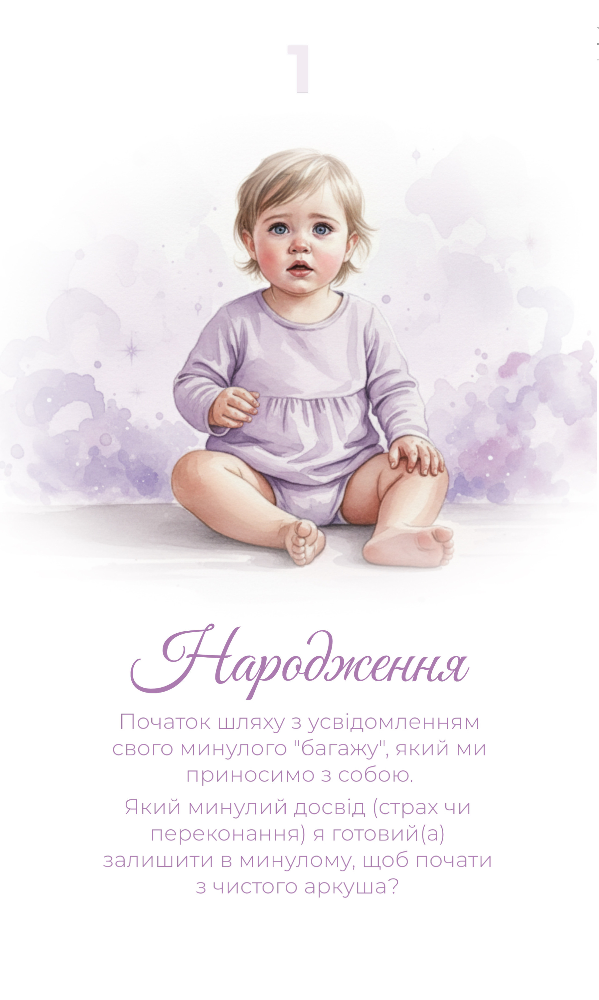
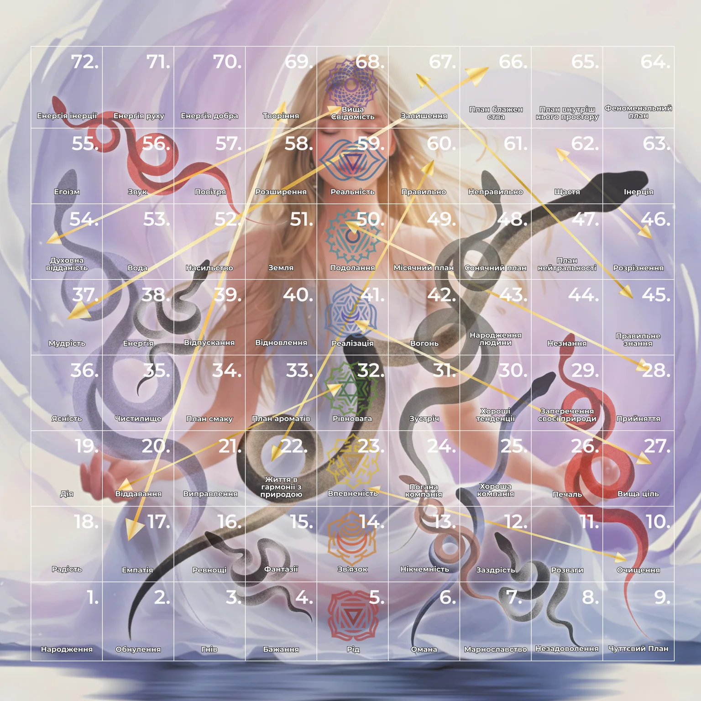
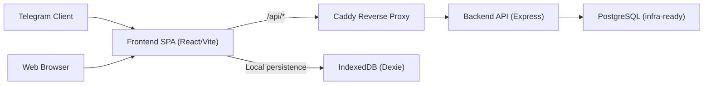

<div align="center">

# Lila Game

### A mindful digital Leela journey for web and Telegram Mini Apps

[](https://github.com/mishaivchenko/lila-game-codex/actions/workflows/deploy.yml)
[](https://github.com/mishaivchenko/lila-game-codex/actions/workflows/ci-cd.yml)
[](#license)
[](https://github.com/mishaivchenko/lila-game-codex/commits/main)
[](https://github.com/mishaivchenko/lila-game-codex/stargazers)


</div>

## What This Project Is
**Lila Game** is a modern digital interpretation of Leela (Leela Chakra), designed for reflective play, journaling, and guided movement through symbolic cells.

This implementation provides:
- **Full board** and **short board** modes.
- **"Глибока гра" (Deep Mode)** teaser experience (locked/coming soon UX).
- **Snake / ladder path animations** tied to board profiles (`snakePaths[]`, `ladderPaths[]`).
- **Card reflection modals** with markdown-capable content and persistent notes.
- **Telegram Mini App + browser support** from the same codebase.

## Core Features
- Click/tap a cell to open the card modal and reflection flow.
- Token movement animation with cell-by-cell path visualization.
- Snake/ladder transitions rendered on board using profile path points.
- Move history with explicit transition path labels (including bounce edge cases).
- Card journaling with local persistence via IndexedDB (Dexie repositories).
- Smooth UI transitions and mobile-first interaction patterns.
- Deep Mode promo overlay integrated into active game UI.
- Telegram shell with WebApp auth handshake and room create/join skeleton.
- Infrastructure prepared for production VPS deployment and CI/CD.
- BoardTheme system with persisted user customization (theme, token color, animation speed).

## Telegram Mini App UX
- Native Telegram shell integration with route-aware **BackButton** and optional **MainButton invite** action.
- Gentle **haptic feedback** for key moments (dice throw, landing, snake/arrow transition, card open).
- Improved fullscreen + safe-area behavior (`env(safe-area-inset-*)`) for iPhone notch / Android gesture areas.
- Runtime Telegram theme sync with `themeChanged` event and `colorScheme` handling.
- Lightweight invite/share flow via `WebApp.shareURL()` with fallback to Telegram deep-link sharing.

## Board Themes & Preferences
- `BoardTheme` is centralized in `/frontend/src/theme/boardTheme.ts`.
- Active theme is managed by `/frontend/src/theme/BoardThemeProvider.tsx`.
- Player preferences are persisted via `settingsRepository` (`selectedThemeId`, `tokenColorId`, `animationSpeed`).
- Current built-in themes:
  - `default-spiritual`
  - `cosmic-dark`
  - `minimal-cream`

## Screenshots / Previews
> Replace or extend these with fresh UI captures when new visuals are shipped.

### Board Example


### Card Example


### Full Board Asset


### Deep Journey Visual Reference


## Tech Stack
- **Frontend:** React 19, TypeScript, Vite, Tailwind CSS, Framer Motion, Dexie.
- **Backend:** Node.js, Express 5, TypeScript, Zod.
- **Infra:** Docker, Docker Compose, Caddy reverse proxy, PostgreSQL.
- **Integrations:** Telegram Mini App WebApp SDK + server-side initData validation.

## Project Structure
```text
lila-game-codex/
├─ frontend/
│  ├─ src/
│  │  ├─ app/                 # Router composition
│  │  ├─ pages/               # Route-level screens
│  │  ├─ components/          # Reusable UI
│  │  ├─ components/lila/     # Board & path animation renderers
│  │  ├─ context/             # Game session state orchestration
│  │  ├─ domain/              # Core game rules/engine
│  │  ├─ features/deep-mode/  # Deep mode UI module
│  │  ├─ features/telegram/   # Telegram shell/auth/rooms
│  │  ├─ lib/lila/            # Coordinates, profiles, move visualization
│  │  ├─ repositories/        # Storage contracts + Dexie adapters
│  │  └─ content/             # Boards/cards/chakras metadata
│  └─ Dockerfile
├─ backend/
│  ├─ src/
│  │  ├─ routes/              # API routes (auth/events/rooms)
│  │  ├─ lib/                 # Token auth + Telegram signature verification
│  │  ├─ store/               # In-memory stores (MVP)
│  │  └─ types/               # API/domain typings
│  └─ Dockerfile
├─ deploy/
│  └─ Caddyfile               # Reverse proxy routing
├─ docs/                      # Setup, deploy and architecture docs
├─ docker-compose.yml
└─ README.md
```

## Architecture Snapshot


## Modes and Gameplay Flow
### Boards
- `full` board profile with full coordinate + transition map.
- `short` board profile for reduced journey mode.

### Movement
1. Dice result resolves the move path.
2. Token animates through **explicit intermediate cells**.
3. If snake/ladder is hit, the renderer uses board profile transition points.
4. Final card modal opens with contextual move information.

### Deep Mode
- UI-level "Глибока гра" card and overlay are present.
- Experience is intentionally locked for now (`Coming Soon — AI Journey`).

## Getting Started
### Requirements
- **Node.js:** `20+`
- **npm:** `10+`
- Docker optional for containerized run.

### Clone and Install
```bash
git clone https://github.com/mishaivchenko/lila-game-codex.git
cd lila-game-codex
npm install
```

### Run in Development (frontend + backend)
```bash
npm run dev
```
- Frontend: `http://localhost:5173`
- Backend: `http://localhost:3001`

### Run Tests
```bash
npm run test:all
```

### Build
```bash
npm run build
```

## Docker and Local Production-like Run
```bash
docker compose up --build
```
Services:
- App entrypoint via Caddy: `http://localhost` (or configured `CADDY_SITE_ADDR`)
- Backend health: `http://localhost/health`

Build individual images:
```bash
docker build -f frontend/Dockerfile -t lila-frontend:local .
docker build -f backend/Dockerfile -t lila-backend:local .
```

## Environment Configuration
Use `.env.example` at repository root as a base.

Critical variables:
- `PUBLIC_URL`
- `CADDY_SITE_ADDR`
- `APP_AUTH_SECRET`
- `TELEGRAM_BOT_TOKEN`
- `POSTGRES_DB`, `POSTGRES_USER`, `POSTGRES_PASSWORD`
- `FRONTEND_IMAGE`, `BACKEND_IMAGE` (for deployment)
- `VITE_TELEGRAM_BOT_USERNAME` (optional, used for Telegram invite links)
- `VITE_TELEGRAM_STARTAPP_PARAM` (optional, default `play`)

More details:
- Telegram setup: [`docs/TELEGRAM_MINI_APP_SETUP.md`](docs/TELEGRAM_MINI_APP_SETUP.md)
- VPS deployment (UA): [`docs/VPS_UA_DEPLOY.md`](docs/VPS_UA_DEPLOY.md)
- Time4VPS deployment: [`docs/TIME4VPS_DEPLOY.md`](docs/TIME4VPS_DEPLOY.md)
- Full architecture report: [`docs/PROJECT_REPORT.md`](docs/PROJECT_REPORT.md)

## CI/CD and Deployment
### Workflows
- [`deploy.yml`](.github/workflows/deploy.yml)
  - Builds frontend/backend images.
  - Pushes to GHCR.
  - SSH deploys to VPS via Docker Compose.
- [`ci-cd.yml`](.github/workflows/ci-cd.yml)
  - Runs tests and build.
  - Builds Docker image and supports Hugging Face fallback flow.

### Standard VPS deploy cycle
1. Push changes to `main`.
2. GitHub Actions builds and publishes images.
3. Deploy job executes on VPS:
   - `docker compose pull`
   - `docker compose up -d --remove-orphans`

## Contributing
1. Create a feature branch from `main`.
2. Keep changes focused and test-covered.
3. Run before PR:
   - `npm run test:all`
   - `npm run build`
4. Update docs when changing architecture, deployment, or major UX flows.

## Quality & Engineering Notes
- Domain gameplay logic is isolated from rendering modules.
- Storage is abstracted behind repositories (`contracts` + adapters).
- Telegram-specific logic is centralized in `features/telegram`.
- Current technical debt and health metrics are tracked in:
  - [`docs/code_health_dashboard.md`](docs/code_health_dashboard.md)
  - [`docs/code_health_metrics.json`](docs/code_health_metrics.json)

## License
No explicit license file is currently published in this repository.
If this project is intended to be open-source, add a `LICENSE` file and update this section.
