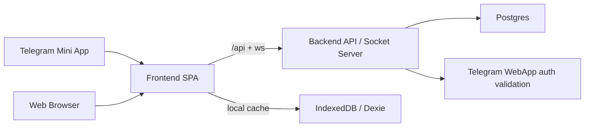

<div align="center">

# Lila Game

### A Telegram Mini App about fate, snakes, ladders, reflection, and a suspicious amount of vibe-coded engineering

[](https://github.com/mishaivchenko/lila-game-codex/actions/workflows/deploy.yml)
[](https://github.com/mishaivchenko/lila-game-codex/actions/workflows/ci-cd.yml)
[](https://github.com/mishaivchenko/lila-game-codex/commits/main)
[](https://core.telegram.org/bots/webapps)
[](https://www.typescriptlang.org/)
[](https://react.dev/)
[](https://nodejs.org/)
[](https://www.docker.com/)

</div>

## What Is This
This is a digital version of **Lila / Leela**: a symbolic self-reflection game where players move through cells, hit snakes and ladders, open cards, write notes, and occasionally get emotionally read by their own dice.

It runs as:
- a **Telegram Mini App**
- a **regular web app**
- a **single-player reflective flow**
- an evolving **host room / group session** system

In short: part game, part journaling tool, part spiritual UX experiment, part "I can explain this architecture, probably".

## Why It Exists
Because a board like this should not live only as a static print artifact.
It should:
- feel alive,
- animate smoothly,
- work on mobile,
- save progress,
- support both personal and guided play,
- and not collapse the moment someone double-taps the board on an iPhone.

## What You Get
- Full board and short board modes
- Smooth token movement with step-by-step travel
- Snake and ladder transitions with card sequencing
- Click/tap a cell to open its card
- Notes and reflections saved per journey
- Theme system with light/dark variants
- Telegram auth and Telegram-adapted shell behavior
- Game history and resumable sessions
- Host room online mode with synchronized board state
- Board zoom, mobile-safe layout, haptics, and generally too much care for tiny UX details

## Screenshots
### Board


### Card


### Short Board


## Main Flows
### 0. Entry Choice (Player vs Host)
After bootstrap, the app starts with a clear first decision:
- **Грати як гравець** for solo/local journey flow
- **Грати як ведучий** for online room facilitation

### 1. Solo Journey
You start a game, roll dice, move through the board, open cards, write notes, and pretend you are "just testing the UI" while actually being called out by the symbolism.

### 2. Telegram Mini App
The app runs inside Telegram with:
- Telegram auth
- theme sync
- safe-area handling
- haptics
- mobile-first layout

### 3. Host Room
A host creates a shared room, players join, and everyone sees the same board state in real time.
Each player rolls their **own** dice. As it should be. Fate is outsourced to no one.

Host-specific rules:
- host identity is unique in a room (host is not duplicated as a regular player)
- host can pause/resume/finish room lifecycle
- host has private facilitator notes per player (not visible to players)
- invites are bot-first and compatible with Telegram deep-links

### 4. Bot-assisted Multiplayer
Room invites and management now run through Telegram bot deep links:
- invite payload uses `room_<ROOM_CODE>` (stable for users, no UUID leakage)
- Mini App auto-detects `start_param` and jumps into room join flow
- plain browser open is treated as fallback, Telegram is the primary entry

Optional bot webhook commands (for admin/operator flows):
- `/start room_<CODE>` open room entry
- `/myrooms` list recent rooms for linked account
- `/room CODE` room status snapshot
- `/pause CODE`, `/resume CODE`, `/finish CODE` host controls

## Stack
### Frontend
- React 19
- TypeScript
- Vite
- Tailwind CSS
- Dexie / IndexedDB
- Framer Motion and custom animation utilities

### Backend
- Node.js
- Express
- TypeScript
- Zod
- Socket.IO
- Postgres-backed persistence with SQL migrations

### Infra
- Docker
- Docker Compose
- Caddy reverse proxy
- GitHub Actions CI/CD
- VPS deployment

## Project Structure
```text
lila-game-codex/
├─ frontend/
│  ├─ src/app/                  # router/bootstrap
│  ├─ src/pages/                # page-level screens
│  ├─ src/components/           # shared UI
│  ├─ src/components/lila/      # board, token, snake/ladder rendering
│  ├─ src/context/              # game state provider
│  ├─ src/domain/               # game rules
│  ├─ src/features/telegram/    # Telegram auth, shell, rooms, sync
│  ├─ src/repositories/         # Dexie + contracts
│  ├─ src/theme/                # board theme + UI tokens
│  └─ public/assets/board/      # optimized board assets
├─ backend/
│  ├─ src/routes/               # REST API
│  ├─ src/socket/               # realtime room sync
│  ├─ src/store/                # persistence-facing domain stores
│  ├─ src/lib/                  # auth, db, Telegram verification
│  └─ migrations/               # SQL migrations
├─ docs/                        # architecture, setup, deploy docs
├─ cards/                       # card image assets
├─ field/                       # legacy/static field assets
└─ deploy/                      # VPS/reverse-proxy config
```

## Architecture In One Diagram


## Running Locally
### Requirements
- Node.js `20+`
- npm `10+`
- Docker optional, but useful when you want to feel like production is nearby and judging you

### Install
```bash
git clone https://github.com/mishaivchenko/lila-game-codex.git
cd lila-game-codex
npm install
```

### Start frontend + backend
```bash
npm run dev
```

Default URLs:
- frontend: `http://localhost:5173`
- backend: `http://localhost:3001`

### Build
```bash
npm run build
```

### Test
```bash
npm run test:all
```

## Docker
Run the whole stack:
```bash
docker compose up --build
```

Useful when you want:
- production-like behavior
- backend + frontend together
- fewer "works on my machine" speeches

## Environment
Main variables:
- `DATABASE_URL`
- `DATABASE_SSL`
- `APP_AUTH_SECRET`
- `TELEGRAM_BOT_TOKEN`
- `PUBLIC_URL`
- `CADDY_SITE_ADDR`
- `VITE_TELEGRAM_BOT_USERNAME`
- `VITE_TELEGRAM_STARTAPP_PARAM`

More setup details:
- [Telegram Mini App setup](docs/TELEGRAM_MINI_APP_SETUP.md)
- [VPS deploy guide](docs/VPS_UA_DEPLOY.md)
- [Time4VPS deploy guide](docs/TIME4VPS_DEPLOY.md)
- [Project report](docs/PROJECT_REPORT.md)
- [Code health dashboard](docs/code_health_dashboard.md)

## Current Product Areas
### Gameplay
- board movement
- card opening flow
- snakes/ladders transitions
- notes and reflections
- history and resume

### UX / Visual System
- board zoom
- theme system
- typography system
- mobile-safe layout
- modal transitions
- Telegram-aware dark/light behavior

### Multiplayer / Guided Flow
- host room creation
- join by code/link
- per-player turns
- realtime shared board state
- pause/resume lifecycle
- host-only private notes and bot-driven invitation hooks

## Engineering Notes
A few things are intentionally true here:
- the board is the hero, not the chrome around it;
- Telegram-specific behavior is isolated instead of smeared across the app;
- gameplay logic is not supposed to depend on presentation code;
- persistence is moving toward a proper server-authoritative model;
- future RAG/AI work should extend the data layer, not hijack the runtime game loop.

That last point matters. If we do AI Lila properly later, it should consume structured journey data, not reverse-engineer chaos from UI state.

## Status
This project is actively evolving.
Some parts are polished.
Some parts are dangerously close to being polished.
Some parts are still honest about being MVP.

That is normal.
This whole thing was, in fact, vibe-coded. Just not irresponsibly.

## Contributing
1. Branch from `main`
2. Keep changes focused
3. Run tests/build before pushing
4. Update docs when changing architecture or flows
5. If you touch game logic, do not "just quickly patch it" unless you enjoy meeting the board bug again in three days

## License
No explicit license is currently published in this repository.
